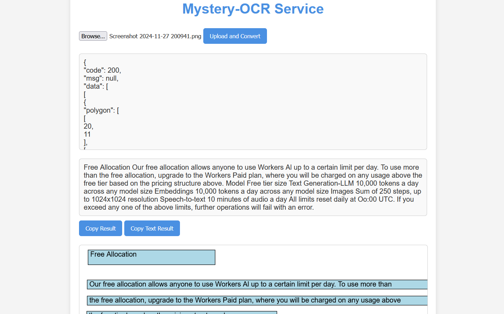

# Mystery-OCR

Mystery-OCR is a lightweight service deployed on Cloudflare Workers, designed for image OCR (Optical Character Recognition) and simple result visualization and processing. By providing an image, this service returns the extracted text information along with a visualized SVG polygon result.

## Features

- **Image Upload**: Supports uploading image files via a web interface.
- **OCR Processing**: Calls an external API to perform OCR on the image and returns recognized text and coordinate information.
- **SVG Visualization**: Displays OCR results as polygons and text on a webpage.
- **Text Extraction**: Provides plain text results extracted from the image.
- **Result Copy**: Allows one-click copying of OCR results to the clipboard.

## Deployment Steps

1. **Create a Cloudflare Worker**
   - Log in to the [Cloudflare Dashboard](https://dash.cloudflare.com/), navigate to the Workers page.
   - Create a new Worker and paste the project code into the Worker editor.

2. **Configure Environment Variables**
   - Go to the Worker `Settings` page and add the following environment variables:
     - `SECRET_ID`: The Secret ID required for API calls (refer to the Environment Variables section).
     - `API_KEY`: The API Key required for API calls (refer to the Environment Variables section).
     - `ENDPOINT`: The target OCR API endpoint (refer to the Environment Variables section).

3. **Save and Deploy**
   - Save the Worker code and click the “Deploy” button to publish the service.

## Environment Variables

| Variable Name | Description                                                  |
|---------------|--------------------------------------------------------------|
| `SECRET_ID`   | The Secret ID for the API, e.g., `Inner_40731a6efece4c2e992c0d670222e6da`. |
| `API_KEY`     | The access key for the API. This is not included in the project. Refer to [this link](https://linux.do/t/topic/78300/69). |
| `ENDPOINT`    | The service URL for the OCR API, e.g., `http://ai.chaoxing.com/api/v1/ocr/common/sync`. |

## How to Use

1. **Access the Service**
   - After deployment, access the generated Worker URL. For example: `https://your-worker-name.workers.dev/`.

2. **Upload an Image**
   - Select an image on the webpage and click the "Upload and Convert" button to start OCR processing.

3. **View and Copy Results**
   - The webpage will display the SVG visualization of OCR results along with plain text results.
   - Click the "Copy Result" or "Copy Text Result" button to copy the results to your clipboard.

## Technical Details

- **Worker Request Handling**
  - **GET Requests**: Returns an HTML page for image upload and result visualization.
  - **POST Requests**: Processes image data, sends the Base64-encoded image to an external API, and returns the parsed results.

- **Signature Encryption**
  - Uses MD5 to generate request signatures to ensure secure API calls.

- **Error Handling**
  - If the API returns non-JSON data, the Worker captures the response and provides a friendly error message.

## Sample Deployment Output

---

If you encounter any issues during deployment or usage, please submit an issue or contact the developer. Note that the API is provided by a third party, and the developer is not responsible for its availability or origin.
